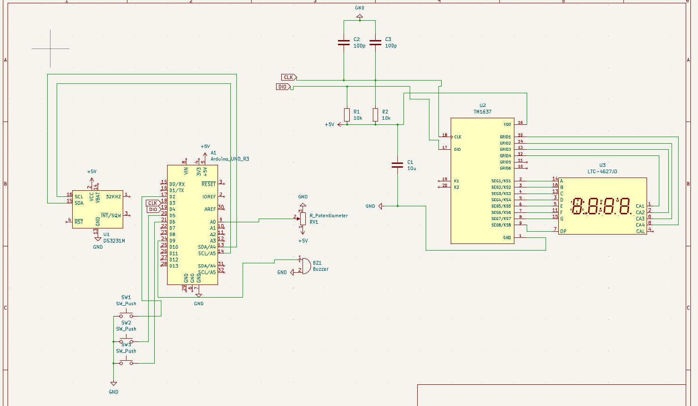

# 🦇 Bat Clock

This is a simple digital alarm clock with a Batman theme to it.

A simulation on how the project works can be found on Wokwi [here](https://wokwi.com/projects/446649526542284801).

---

## 🧰 Parts used

- Arduino Uno  
- **DS3231 RTC Module**
  - SDA → A4  
  - SCL → A5  
- TM1637 (4-digit 7-segment) display  
- **3× Push Buttons**
  - Mode  
  - Hour Increment  
  - Enter  
- **A Potentiometer** (A0) 
- Buzzer 

---

## 🔧 Mode Overview

### **Normal Mode**
- Displays the current time.  
- If current time == alarm time → buzzer output triggers.

---

### **Alarm Mode**
Used to **set alarm time**.

- **Hour Increment button** → increases hour
- **Potentiometer** → changes minutes  
- **Enter** → sets the alarm time

---

### **Set Mode**
Used to **change the actual clock time**.

- **Hour Increment button** → increases hour  
- **Potentiometer** → changes minutes  
- **Enter** → set the time

---

## 🧱 Enclosure

Here is an image of the enclosure design:


You can find the latest version of the 3d model here:
```
Bat Clock/
├── 3D Models/
   └── Bat Clock v2.f3d
```

---
## Schematic
Here is a preview of the schematic design:



You can find the schematic here:
```
Bat Clock/
├── Schematics/
   └── alarm_clock.kicad_sch
```

---

---
## Disclaimer
The project is not done and stil need to under go some revisions especially with the 3d model.

Still yet to check the tolerances and make sure everything fits well

